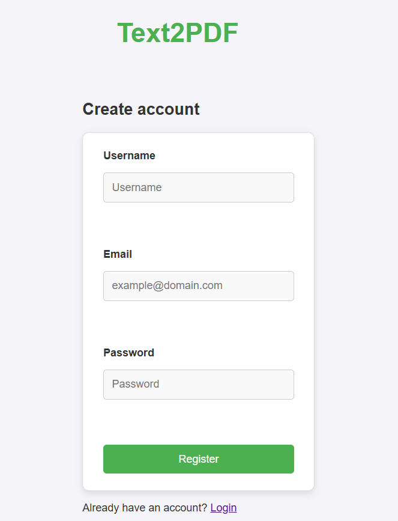
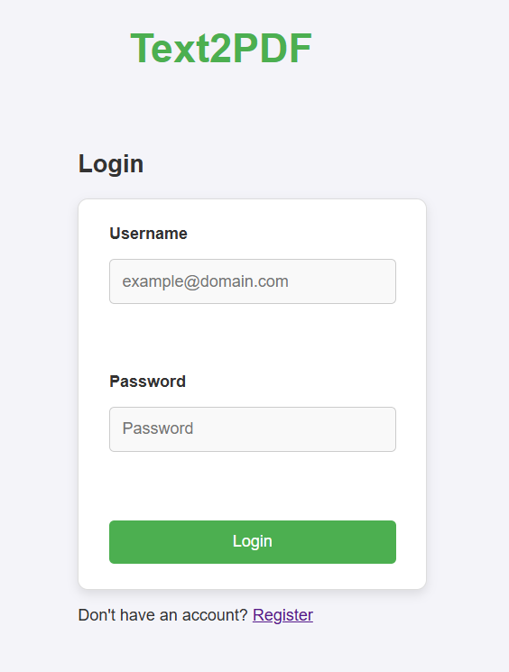
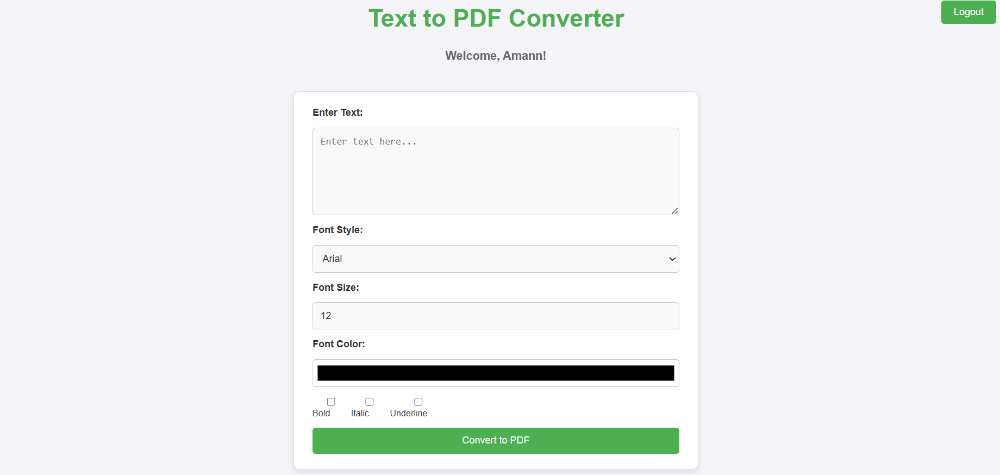

# Text2PDF

## Description

**Text2PDF** is a web-based application that allows users to convert their text into PDF format with customizable formatting options. Users can input their text, adjust the font style, size, and color, and apply various text styles such as bold, italic, and underline. The project is designed to be highly responsive, ensuring a seamless experience across devices including desktops, tablets, and mobile phones.

## Features

- **User Authentication**: Users can register, log in, and manage their account securely.
- **Text Input**: Users can enter their text into a textarea.
- **Customizable Text Options**: Choose font style, size, and color, and apply bold, italic, or underline styles.
- **PDF Conversion**: Convert the formatted text to a downloadable PDF file.
- **Responsive Design**: The app is fully responsive, providing an optimal experience on desktops, tablets, and mobile devices.
- **User Logout**: Securely log out of the application, with the button being responsive for mobile devices.
- **Form Validation**: User input fields are validated to ensure proper data entry.

## Tech Stack

- **Frontend**:
  - HTML5
  - CSS3 (with Flexbox and Media Queries for responsiveness)
  - JavaScript (for interactive elements like the logout button)
  
- **Backend** (if applicable):
  - Flask (Python Web Framework)
  - PostgreSQL (for user data storage)
  
- **Libraries & Tools**:
  - **Python** (for backend development)
  - **Flask** (for creating the web application)
  - **PostgreSQL** (for storing user credentials and data)
  - **JS** (for client-side interactivity)

## Deployment

The **Text2PDF** application is deployed and live on [Render](https://render.com/). You can access the live demo at the following URL:

[Text2PDF Live Demo](https://text2pdf-4vyx.onrender.com) *(Replace with actual URL once deployed)*

You can test the application directly by visiting the link, where you can input your text, customize the styling, and convert it to a PDF.

## Installation

### 1. Clone the repository
git clone https://github.com/vedantfutane/Text2pdF.git

### 2. Navigate to the project directory
Copy code
cd Text2PDF

### 3. Install required dependencies
Copy code
pip install -r requirements.txt

### 4. Set up the database
You will need a PostgreSQL database to store user data. Make sure you have PostgreSQL installed and create a database. Then, run the necessary migrations to set up the database schema.

### 5. Run the application
python app.py
The app will be running on http://127.0.0.1:5000/. You can visit this URL in your browser to view the application.

## Usage
**Homepage**: The homepage welcomes users with a friendly message and provides an option to log in or register.

**Login/Register**: New users can register by providing a username, email, and password. Existing users can log in with their credentials.

**Text Input Form**: Once logged in, users can input text, customize the font style, size, and color, and apply text formatting (bold, italic, underline). A "Convert to PDF" button will generate a downloadable PDF based on the input text.

**PDF Download**: After customization, users can download the PDF by clicking the "Convert to PDF" button.

**Logout**: After using the application, users can log out securely. The logout button is positioned at the top-right and is responsive, adjusting its position on smaller screens.

## Screenshots

## Mobile view of the form.

### Contributing
We welcome contributions to improve the project! If you have suggestions or find issues, feel free to fork the repository, make changes, and submit a pull request.

### To contribute:

### Fork this repository
Create a new branch: git checkout -b feature-branch
Make your changes.
Commit your changes: git commit -am 'Add new feature'
Push to the branch: git push origin feature-branch
Open a pull request.

### License
This project is licensed under the MIT License - see the LICENSE file for details.

### Acknowledgements
Thanks to Flask for powering the backend.
Inspired by modern web design and user-friendly UI patterns.
Special thanks to all the contributors and open-source libraries used in the project.
Made with ❤️ by Vedant Futane

### Key Information:
- **Deployment Section**: I've included the Render deployment section with a placeholder link. Once deployed, replace the placeholder with the actual URL.
- **Tech Stack and Instructions**: I've included tech stack and step-by-step instructions for installation and usage.